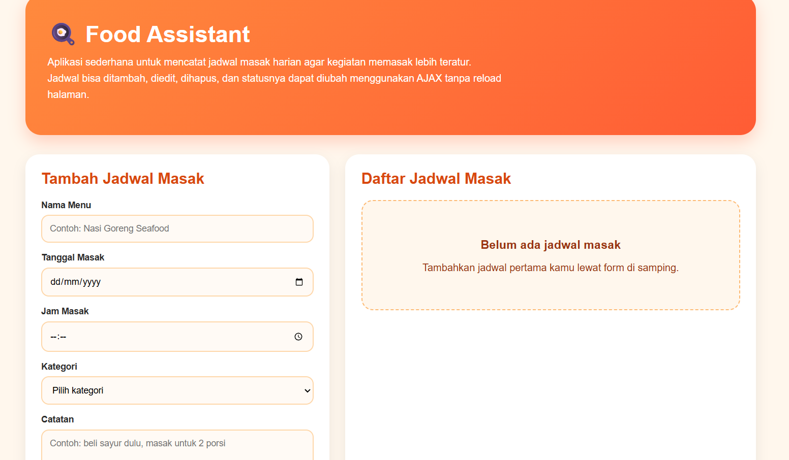

# Food Assistant

Food Assistant adalah aplikasi web sederhana berbasis Laravel yang digunakan untuk mencatat jadwal masak harian. Aplikasi ini dibuat untuk menerapkan penggunaan AJAX agar proses tambah, edit, hapus, dan ubah status jadwal dapat dilakukan tanpa reload halaman.

## Fitur Aplikasi

- Menambahkan jadwal masak baru
- Menampilkan daftar jadwal masak
- Mengedit detail jadwal masak
- Mengubah status jadwal masak
- Menghapus jadwal masak
- Menampilkan pop up notifikasi saat data berhasil ditambahkan, diedit, dihapus, atau status diubah
- Menggunakan AJAX agar halaman tidak perlu dimuat ulang

## Teknologi yang Digunakan

- Laravel
- HTML
- CSS
- JavaScript
- AJAX Fetch API
- Session Laravel

## Cara Menjalankan Project

1. Clone repository

```bash
git clone link-repository-kamu

## Tampilan Aplikasi

Berikut adalah tampilan halaman utama aplikasi Food Assistant.


